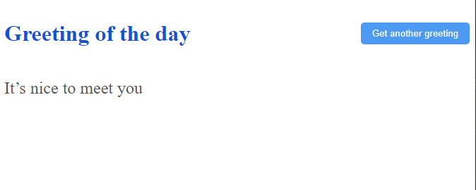

# Hello Rails React
> This is a React-Rails app that displays the random greeting using API. 

## Screenshot

# Built With

- Ruby on Rails
- React
- Redux
- PostgreSQL

## Getting Started

To get a local copy up and running follow these simple example steps.

### Prerequisites

- [Ruby](https://www.ruby-lang.org/)
- [Ruby on Rails](https://rubyonrails.org/)

### Setup
- Clone or download this repo on your machine
- Enter project directory
- Run ` npm install` to install dependencies
- Run `install bundle` to install dependencies
- Run  `rails db:create` to create a database
- Run  `rails db:migrate` to create a migrations
- Run  `rails db:seed` to add data to the database

### Run

Run `rails s` to run the server and open `localhost:3000` in browser

### Test

Run `bundle exec rspec` to run tests
## Author

👤 **Tolib**

- GitHub: [@toliboff](https://github.com/toliboff)
- Twitter: [@tolib_tolibov](https://twitter.com/tolib_tolibov)
- LinkedIn: [Tolibjon Tolibov](https://linkedin.com/in/tolibjon-tolibov)

## 🤝 Contributing

Contributions, issues, and feature requests are welcome!

Feel free to check the [issues page](https://github.com/toliboff/hello-rails-react/issues).

## Show your support

Give a ⭐️ if you like this project!

## Acknowledgments
- [Microverse](https://www.microverse.org/) 
